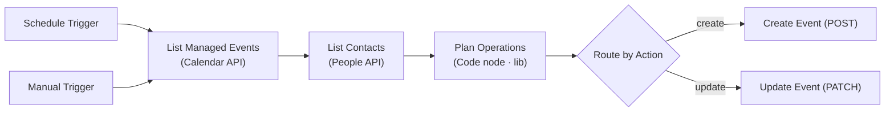

# birthday-sync

Syncs **birthdays from Google Contacts** into a dedicated **Google Calendar** as
**yearly, all-day recurring events** — a replacement for the native
Contacts→Calendar birthday sync, which has been disabled in Germany since 2024
for regulatory reasons.

- **Idempotent:** running it any number of times never creates duplicates.
- **Self-healing:** a renamed contact, a changed birthday, or a new age in the
  title is detected and the event is updated.
- **Two entry points, one branch:** a daily schedule and an on-demand manual run
  both feed the exact same upsert logic.

## Node graph



1. **Schedule Trigger** — fires on `BIRTHDAY_SYNC_SCHEDULE` (default `0 6 * * *`,
   i.e. daily at 06:00 Europe/Berlin). The active value is injected from `.env`
   by `scripts/deploy.ts`.
2. **Manual Trigger** — click **Execute Workflow** in the editor for an on-demand
   full sync at any time.
3. **List Managed Events** — `GET` on the target calendar filtered by
   `privateExtendedProperty=managedBy=birthday-sync`, so it only ever sees events
   this workflow created (paginated). It reads recurring **masters**
   (`singleEvents=false`) — one per contact.
4. **List Contacts** — `GET people/me/connections?personFields=names,birthdays`
   (paginated).
5. **Plan Operations** — a Code node whose logic comes from
   [`lib/calendar-upsert.js`](../../lib/calendar-upsert.js). It normalizes
   contacts, matches them to existing events, and decides **create / update /
   skip** for each (see below). `skip`s are dropped so nothing downstream runs
   for unchanged contacts.
6. **Route by Action** — a Switch that sends `create` items to **Create Event**
   (`POST`) and `update` items to **Update Event** (`PATCH`).

## Why these choices

| Decision | Rationale |
|----------|-----------|
| **HTTP Request nodes**, not the native Google Contacts/Calendar nodes | The native nodes have known field bugs and don't cleanly set/filter `extendedProperties`. Direct REST calls give full control. |
| **Regular events + `RRULE:FREQ=YEARLY`**, not `eventType=birthday` | Only regular events support `extendedProperties` and secondary calendars reliably. |
| **One Google OAuth2 credential** (generic OAuth2) for both APIs | A single credential with scopes `contacts.readonly` + `calendar.events` powers every HTTP node. |
| **All-day**, `transparency: transparent` | Doesn't block "busy" time in your calendar. |

## Idempotency & dedup (the important part)

Every event carries private metadata:

```json
"extendedProperties": {
  "private": {
    "managedBy": "birthday-sync",
    "contactId": "people/c1234567890",
    "sig": "a1b2c3d4"
  }
}
```

- **`contactId`** is the People API `resourceName` — a stable per-contact id. It
  is the dedup key: the workflow lists existing events by `managedBy` and indexes
  them by `contactId`.
- **`sig`** is a content signature (hash of name + month + day + year + title).

Decision per contact:

| Situation | Action |
|-----------|--------|
| No event with this `contactId` | **create** (`POST`) |
| Event exists but stored `sig` ≠ recomputed `sig` | **update** (`PATCH`) |
| Event exists and `sig` matches | **skip** |

Because matching is by `contactId` (not by title or date), repeated runs are
safe. A no-change run produces **zero** create/update items — the cleanest proof
of idempotency.

## The age in the title

With `SHOW_BIRTH_YEAR=true` and a known birth year, the title reads
`🎂 Anna (turning 40)`, where the age is the one reached on the **upcoming**
birthday. Since a single yearly-recurring event has one shared title, the age is
a snapshot — it stays correct because the **daily sweep recomputes it** and the
signature-based update refreshes the event when the number rolls over. Set
`SHOW_BIRTH_YEAR=false` for name-only titles (`🎂 Anna`).

## Configuration (from `.env`)

Every value below is read by **`scripts/deploy.ts` on the GitHub runner** and baked
into the workflow at deploy time. The workflow itself reads no environment variables
— that is what lets the container block env access to nodes, so nothing running in
n8n can reach `N8N_ENCRYPTION_KEY`. Change a value → re-run the deploy.

| Variable | Effect |
|----------|--------|
| `CALENDAR_ID` | Target calendar the events are written to. Required — the deploy fails without it. |
| `SHOW_BIRTH_YEAR` | `true` (default) → show `(turning N)` when a birth year exists. |
| `BIRTHDAY_SYNC_SCHEDULE` | Cron for the Schedule Trigger. |
| `GOOGLE_OAUTH_CRED_ID` | Optional; if set, `deploy.ts` wires the credential into every HTTP node automatically. |

## Edge cases handled

- **No birth year** (very common) → event still created; anchored to the current
  year; no age suffix.
- **Feb 29** → the series is anchored to a leap year, so `start.date` is always a
  real date. That covers an unknown birth year *and* a known one that isn't a
  leap year (bad contact data). The age in the title still uses the real year.
- **Impossible dates** (`month: 13`, April 31, Feb 30) → contact skipped, rather
  than sending an invalid `start.date` that the Calendar API answers with a 400.
- **The same contact seen twice** → de-duplicated by `resourceName`. Matters
  because the idempotency check runs against the *calendar*: two copies of a
  contact that has no event yet would otherwise plan two `create`s.
- **Contacts without a usable birthday** → skipped.
- **Contacts with multiple birthday entries** → the first with a structured
  month+day is used.
- **> 1000 contacts / > 2500 events** → both list nodes paginate on
  `nextPageToken`. `List Contacts` is marked `executeOnce`, so a multi-page
  event list can't make it run (and fan out) more than once.
- **A transient Google error** (429/5xx) → every HTTP node retries 3× with 5 s
  in between. If it still fails the run stops and shows red in the execution
  list; since the sync is idempotent, the next daily run picks up where it left
  off. There is deliberately no "continue on error" — that would turn a partial
  sync into a green run. Note there is no *notification* yet: a failure is only
  visible in the n8n UI.

## Not handled (by design)

- **Deleting** events for contacts whose birthday was removed or who were deleted
  in Contacts. This is intentionally conservative (no destructive operations).
  Remove such events manually, or extend `Plan Operations` to emit deletes.

## Trigger it manually

Open the workflow in n8n → **Execute Workflow**. Or run
`npm run deploy` after any change to re-push and (re)activate it.

## Files

- [`workflow.json`](workflow.json) — the n8n workflow (generated with the `lib/`
  logic already inlined; kept in sync by `npm run sync`).
- Business logic: [`../../lib/calendar-upsert.js`](../../lib/calendar-upsert.js)
  (+ `calendar-upsert.test.js`).
